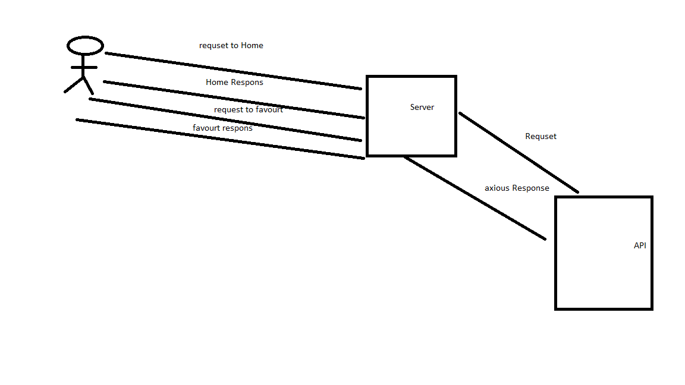

# Movies-Library
# Project MovieLibrary - Project 1.0.0.0

**Author Name**: Abdelkareem Barham

## WRRC

## Overview

## Getting Started
<!-- the steps is :
1-adding new route that use API to search for a movie
2- adding a route that use API ti find movie by IP
3- adding a route that use trending API -->

## Project Features
<!-- What are the features included in you app -->
<!-- our project give a data about movie and its name and ID and you can search for a movie and trending movie-->